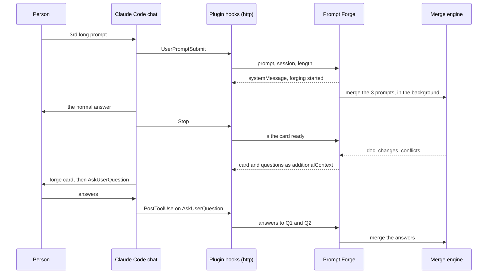

# Auto-forge, design

Status: design, not built. Every mechanism below was read out of Claude Code 2.1.272 on 2026-09-15, and the day-1 test ran the same day: real chats in a terminal and in the VS Code panel against a stand-in endpoint. Rows marked ⚠️ are still untested.

## Problem

Prompt Forge only sees ideas someone brings to it. The people who most need it are halfway through a big job in a Claude Code chat, sending long prompt after long prompt, each adding requirements and some contradicting the last. By the time they think of opening Prompt Forge, the drift has already happened.

Auto-forge notices that pattern in the chat and does the forging there. It merges the long prompts into one prompt document, shows what it merged, and asks what is still undecided. All of it happens in the chat.

## Scope

Claude Code conversations on the machine running Prompt Forge: the Claude Code panel and `claude` in a terminal, including over Remote-SSH, where both run on the remote host. Not claude.ai or the Claude desktop app: they have no hooks.

## What Claude Code allows

| Need | Mechanism | Status |
|---|---|---|
| Read each prompt as it is sent | `UserPromptSubmit` hook: `prompt`, `session_id`, `prompt_id`, `cwd`, `transcript_path` | ✅ tested |
| Silent when Prompt Forge is closed | A `command` hook, `curl -s -m 3 -X POST --data-binary @- <url> \|\| true`. An `http` hook was tested first and failed: it printed "hook error: connect ECONNREFUSED" on every prompt | ✅ tested (curl), ❌ http |
| Show that forging started | `systemMessage` on the hook reply. The panel and the terminal both show it as "UserPromptSubmit says: …" | ✅ tested |
| Put the card and questions into the chat | `Stop` hook reply with `hookSpecificOutput.additionalContext`. Replying `decision: "block"` instead shows "Stop hook error" and prints the instructions. `stop_hook_active` was true on the next stop, as documented | ✅ tested |
| An answer tied to its question | `AskUserQuestion`, Claude Code's own question dialog, in the panel and the terminal. Claude used the headers and options exactly as given | ✅ tested |
| Capture those answers | `PostToolUse` hook, matcher `AskUserQuestion`: `tool_input.answers` is keyed by question text | ✅ tested |
| `/forge`, `/unforge` | Plugin commands; the `UserPromptExpansion` hook sees them | ⚠️ |
| A link in a chat message that calls Prompt Forge | The panel renders markdown links as links. A click goes panel `openURL` → `vscode.env.openExternal` → Prompt Forge's URI handler, which already handles `/join` | ✅ renders, ⚠️ click untested |
| A button that pre-fills the chat input | `claude-vscode.editor.open(session, text)` refuses for an open conversation: "Session is already open. Your prompt was not applied" | ❌ |
| Buttons or cards drawn inside the Claude Code panel | No API | ❌ |

## Answers to the open questions

**1. What counts as a longer prompt.** The average length of forged prompts can't set the threshold, because it's circular. Nothing is forged until a threshold exists. Once one exists, only prompts above it get forged, so their average can only climb, and auto-forge would slowly switch itself off. Instead, the threshold starts from the person's own prompt lengths and moves on their feedback (see Detection).

**2. Same merge rules or an in-chat version.** Use the same merge engine and rules as Prompt Forge. That keeps its core promise: a contradiction is never resolved silently. The forge lands in the library as a normal prompt that can be opened, polished and sent. The chat receives a card of a few hundred tokens rather than a whole document written into the person's working context. The cost is one fast-model merge call per forge.

**3. Undo in confirm-first mode.** Undo applies in both modes. In confirm-first, the person says yes before seeing what merged; the card is their first look, so undo is still needed. Cancel differs: in auto mode it drops a merge still in flight, and in confirm-first it is the "Not now" answer.

## How it works



| Piece | Where | Reload |
|---|---|---|
| Claude Code plugin `prompt-forge`: four `curl … \|\| true` command hooks, `/forge`, `/unforge` | `claude-plugin/` in the vsix, installed with `claude plugin marketplace add` + `claude plugin install` when auto-forge is switched on, removed when it is switched off | n/a |
| Local endpoint on 127.0.0.1, per-install token in the URL path written into the plugin's `hooks.json` | `src/autoforge/agent.js` | hot |
| Long-prompt test, trigger rule, tuning | `src/autoforge/detect.js`, pure | hot |
| Card and question text | `src/autoforge/card.js`, pure | hot |
| Creating and updating the chat's forged prompt | runtime + `session.js`, same queue as typed ideas | hot |
| Settings | `package.json` | one restart, at release |

## The moment in the chat

Auto mode:

1. The person sends their third long prompt. Prompt Forge counts it, and the trigger fires. The merge starts in the background. The hook's `systemMessage` reads: `Prompt Forge: forging this chat's 3 long prompts. Type /unforge to cancel.`
2. Claude answers the prompt as normal. Nothing waits on the merge.
3. Claude finishes. Prompt Forge waits up to 20 s for the merge, then the `Stop` hook replies with the card and the questions. Claude posts the card as given and calls `AskUserQuestion`. If the merge takes longer than 20 s, Claude stops and the card goes out at the next `Stop`.
4. The answers arrive through `PostToolUse`. They are logged against their question ids and merged: a conflict answer as keep-old or keep-new, anything else as an idea.

Confirm-first: step 1's line reads `Prompt Forge: this looks like a bigger job.` No merge starts. At `Stop`, Claude asks one question, "Forge these 3 prompts into one brief?", with three answers: **Forge them**, **Not now**, **Never in this chat**. **Forge them** starts the merge; Claude's turn continues, and the card comes at that turn's `Stop`.

## Detection

A prompt counts as long when all of these hold:

- it is at least **L** characters once pasted code fences, stack traces and @-mentions are stripped (L starts at 400)
- it is not a slash command, an answer to a forge question (`Q2: …`), or a hook wrapper

**Trigger:** **N** long prompts (default 3) in one conversation, within its last 8 prompts, none of them forged yet. After a forge, N more long prompts send a forge update into the same forged prompt, and the card reads "+2 prompts".

**Seed:** when auto-forge is switched on, L is set to the 75th percentile of the person's last 200 prompt lengths under `~/.claude/projects`, clamped to 250–1,200. Only lengths are read, never text.

**Tuning:** auto-adjust stays on until L is pinned.

| Signal | How it arrives | Effect on L |
|---|---|---|
| Wrong detection | Card link, or `/forge wrong` | L = max(L, median length of that forge's prompts) × 1.15 |
| Undo | Within 15 minutes of the card | × 1.05 |
| Not now | Confirm-first answer | × 1.03 |
| Kept | 5 forges in a row with no undo and at least one question answered | × 0.95 |

L stays within 200–2,000 characters and changes at most once a day; the strongest signal of the day wins. A pinned L keeps its value, and the digest still shows what it would have become.

**Digest:** shown in Prompt Forge's panel, never as a VS Code pop-up (house rule, enforced by `test/shell.test.mjs`).

- When L changes, the panel shows one notice with the reason: "Auto-forge now counts prompts of 460+ characters (was 400): you marked Tuesday's forge a wrong detection."
- Settings › Auto-forge keeps a weekly row: forges, undone, wrong detections, and the history of L.

## Modes, cancel and undo

| | Auto | Confirm first |
|---|---|---|
| At the trigger | The merge starts | Claude asks first |
| Cancel before the card | `/unforge` or the systemMessage hint drops the merge in flight | Not now |
| Undo after the card | ✅ | ✅ |
| Wrong detection | ✅ | ✅ |

Undo sends a new forged prompt to Prompt Forge's trash (restorable) and restores the snapshot before a forge update. Its prompts are marked so they never count again. On the next prompt, the `UserPromptSubmit` hook adds context telling Claude to drop that forge's questions.

## Summary card

Claude posts it as given. It is built from the merge's `changes` and `conflicts` and is at most 12 lines.

```markdown
**Prompt Forge** · forged 3 prompts into *Checkout redesign brief*
- Goal: written
- Requirements: +5
- Constraints: +2
- Output format: new section
- Held back: 1 conflict (Requirements: "Stripe only" vs "Stripe and PayPal")

[Undo](vscode://trifactorscaling.prompt-forge-trifactor/forge/undo?id=f7) · [Wrong detection](vscode://trifactorscaling.prompt-forge-trifactor/forge/wrong?id=f7) · [Open in Prompt Forge](vscode://trifactorscaling.prompt-forge-trifactor/forge/open?id=f7) · or type /unforge
```

## Questions and replies

Each forge gets up to 3 questions, chosen in this order: conflicts, then "action" suggestions, then the Open questions section. Ids are Q1, Q2, … and stay the same for the life of the forged prompt.

- **In the chat:** `AskUserQuestion` shows the question with 2–4 options drawn from the document (keep old or keep new, for a conflict) and a typed answer. Each answer comes back tied to its question.
- **Typed later:** a message starting `Q2:` is logged as the answer to Q2, is not counted for detection, and Claude is told it was logged.
- **In Prompt Forge's panel:** the open-question card gets a **Reply** button. It fills the idea box with `Re Q2 (Decide what the visual signal looks like): ` and stores the entry with `answers: "Q2"`.

The one thing asked for that Claude Code does not allow is a button that pre-fills the chat input (❌ above). `AskUserQuestion` is the in-chat reply that stays tied to its question, and `Q2:` covers answering later.

## Settings

| Setting | Values | Default |
|---|---|---|
| `promptForge.autoForge` | `off`, `confirm`, `auto`. Switching away from `off` installs the plugin; back to `off` removes it | `off` |
| `promptForge.autoForge.minChars` | 200–2,000, or 0 for tuned | 0 |
| `promptForge.autoForge.minPrompts` | 2–10 | 3 |
| `promptForge.autoForge.questions` | 0–4 per forge | 3 |
| `promptForge.autoForge.exclude` | Folder globs where it never runs | `[]` |

Settings › Auto-forge in the panel shows the same controls, with how often each has triggered beside them.

## Data

- The sidecar gains `origin` (`claude-chat`, session id, folder), `entries[].source` (session id, prompt id), `questions[]` (`id`, `kind`, `text`, `options`, `answer`, `via`: dialog, typed or panel) and `forges[]` (trigger lengths, mode, feedback: kept, undone or wrong).
- `~/.prompt-forge/autoforge.json` holds L, whether it is pinned, and its change history (`ts`, `from`, `to`, `reason`).
- Prompts that have not triggered a forge are held in memory, at most 8 per conversation, and are never written to disk.

## Failure modes

| Case | What happens |
|---|---|
| Prompt Forge is not running | `curl` fails, `\|\| true` swallows it, and Claude Code carries on with nothing shown (tested) |
| The hook's instructions to Claude | The terminal prints the `Stop` hook's context in full as "Stop hook feedback"; the panel did not show it. Keep it to the card and one line asking for the questions |
| Instructions that clash with the person's | Claude weighs hook context against what the person asked. In the test it noted "the user asked for no tools", then went ahead. Never ask for anything the person has ruled out |
| Several VS Code windows | The first binds the port; the others retry every 30 s |
| Engine not signed in | No forge; one line per conversation: "Prompt Forge could not forge: sign in first" |
| Merge fails | The card says why; the prompts stay unforged and count again |
| Claude rewords the card | Links, ids and commands still work; only the look changes |
| Stop hook loops | One forge injection per turn; nothing is returned while `stop_hook_active` is true |

## Privacy

Auto-forge is off by default, and switching it on lists exactly what is read. Prompt text leaves the machine only inside the merge call to the engine the person already uses. The endpoint listens on 127.0.0.1 behind a per-install token. A `.no-autoforge` file in a folder turns auto-forge off there.

## Cost

| | Model calls |
|---|---|
| Detection | None |
| Each forge | One fast-model merge, plus one short extra Claude turn in the chat for the card (about 300–800 tokens) |
| Each batch of answers | One merge |

## Build order

**Day 1 spikes, run 2026-09-15:**

| Check | Terminal | VS Code panel (Remote-SSH) |
|---|---|---|
| `systemMessage` visible | ✅ | ✅ |
| `Stop` hook gets the card posted as given, then `AskUserQuestion` | ✅ | ✅ |
| `PostToolUse` carries the answers | ✅ | ✅ |
| Silent when the endpoint is down | ✅ with `curl \|\| true`, ❌ with an http hook | not run, same hook config |
| Card link reaches Prompt Forge's URI handler | n/a | ✅ renders, ⚠️ click untested |

Still to check: clicking a card link, and the `curl` hook on Windows (Claude Code runs hooks through Git Bash there).

**Phase 1:** plugin, endpoint, detection, confirm-first, card, undo, `/unforge`. Ships with the setting `off`.
**Phase 2:** questions, answers, `Q2:`, and the Reply button in the panel.
**Phase 3:** auto mode, tuning, wrong detection, digest.
